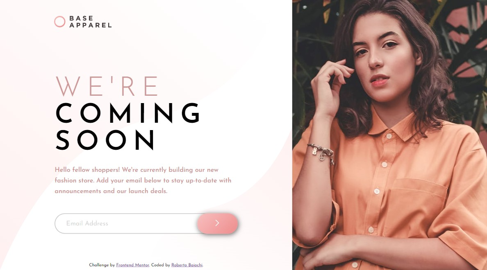
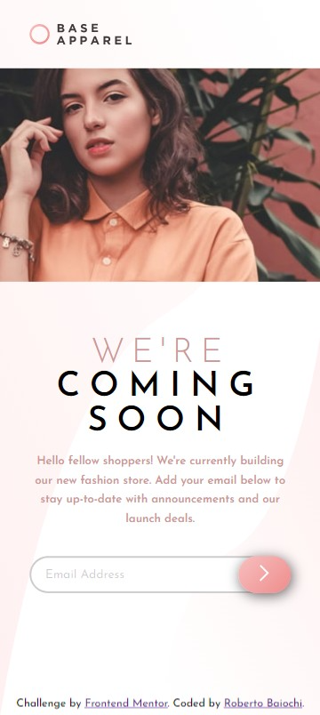

# Frontend Mentor - Base Apparel coming soon page solution

This is a solution to the [Base Apparel coming soon page challenge on Frontend Mentor](https://www.frontendmentor.io/challenges/base-apparel-coming-soon-page-5d46b47f8db8a7063f9331a0). Frontend Mentor challenges help you improve your coding skills by building realistic projects. 

## Table of contents

- [Overview](#overview)
  - [Screenshot](#screenshot)
  - [Links](#links)
- [My process](#my-process)
  - [Built with](#built-with)
  - [What I learned](#what-i-learned)
  - [Continued development](#continued-development)
- [Author](#author)
- [Acknowledgments](#acknowledgments)

## Overview
 It was a cool challenge :)

### Screenshot

### Links

- Live Url : https://robertobaiochi.github.io/frontEndMentor-baseApparel/

## My process

### Built with

- Semantic HTML5 markup
- CSS custom properties
- JavaScript

### What I learned

I was able to practice a little of what I'm studying with JavaScript and as always a good learning of responsiveness.

### Continued development

Keep studying JavaScript and the possibilities of what can be done with it, and pay more attention to responsiveness.

## Author

- Frontend Mentor - [@RobertoBaiochi](https://www.frontendmentor.io/profile/RobertoBaiochi)

## Acknowledgments

I thank the entire community, it's unbelievable the amount of good people I ended up meeting as soon as I started studying, you guys are inspiring and I hope one day I can be too. :D
